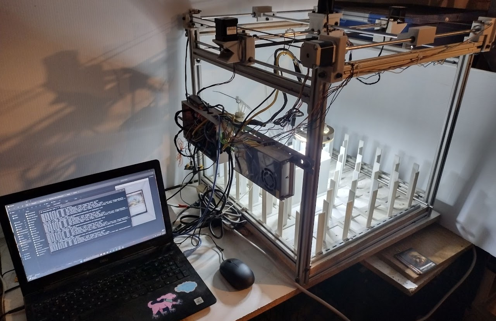
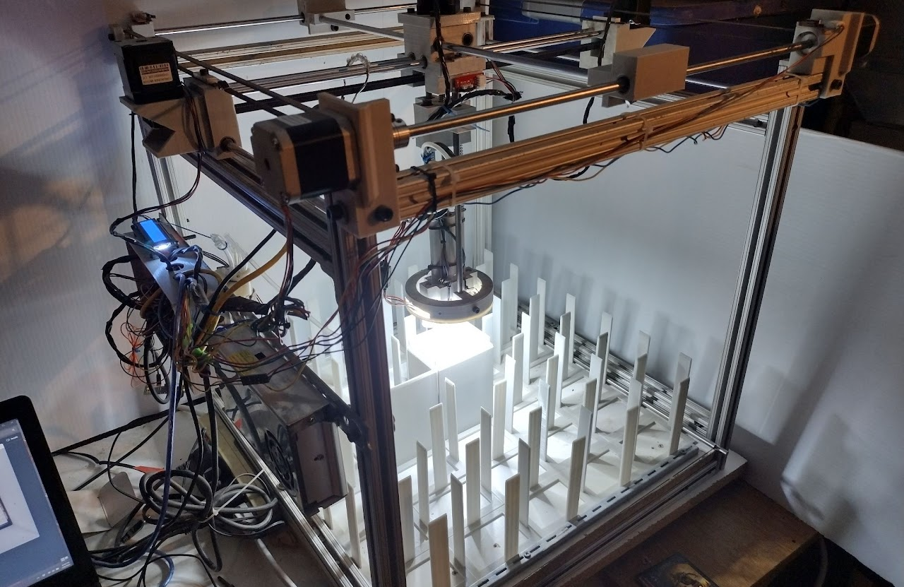
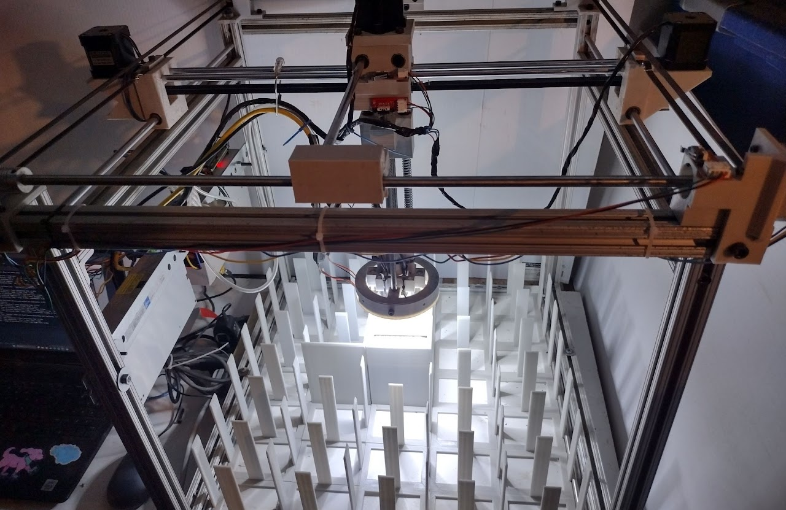
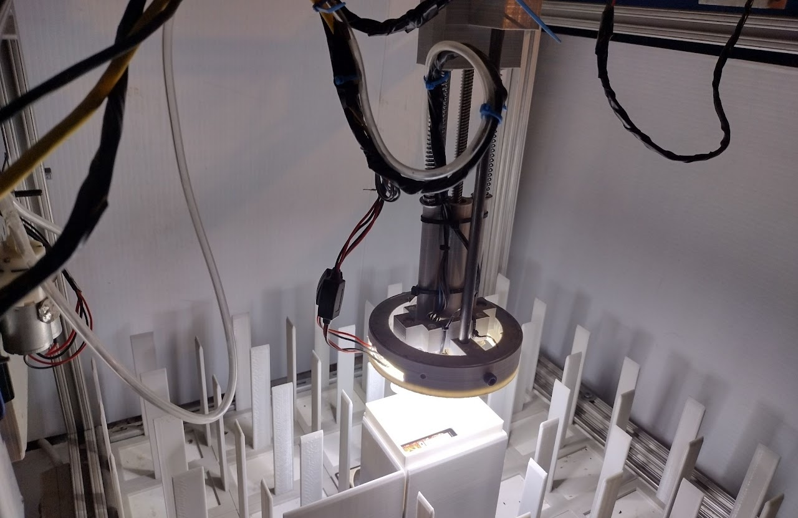
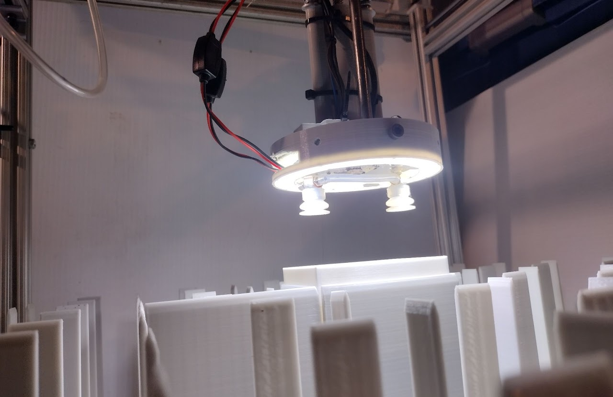
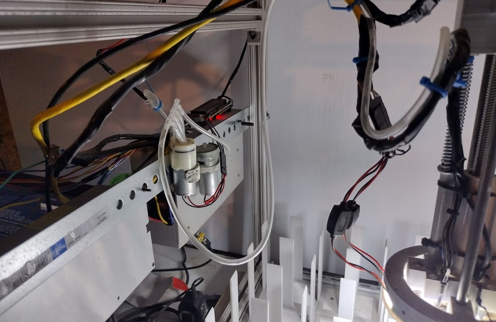
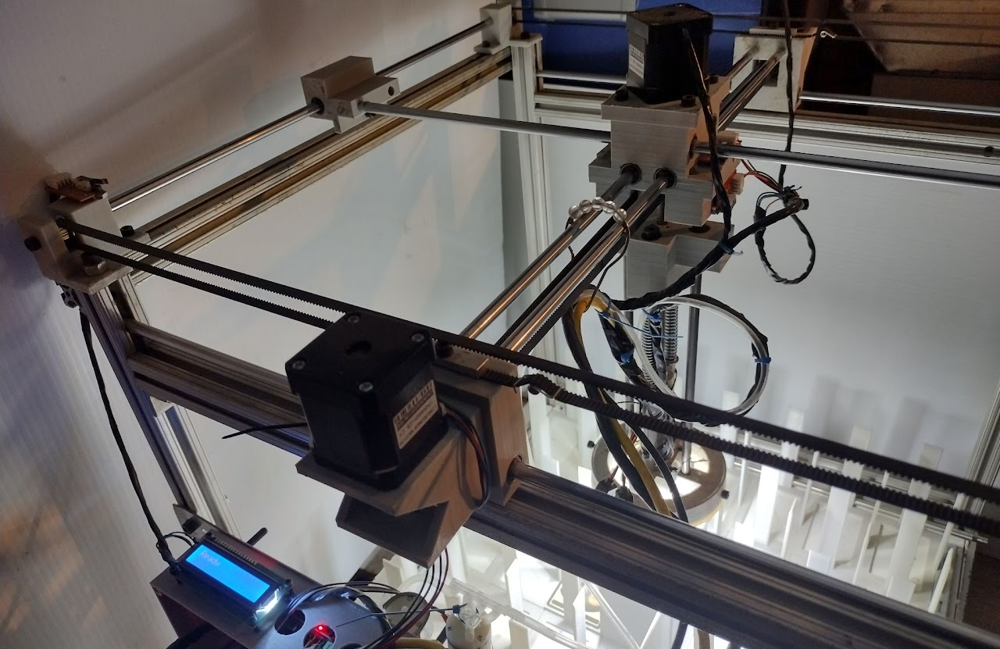
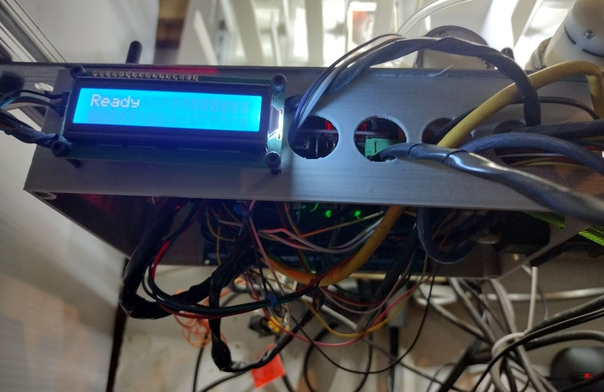
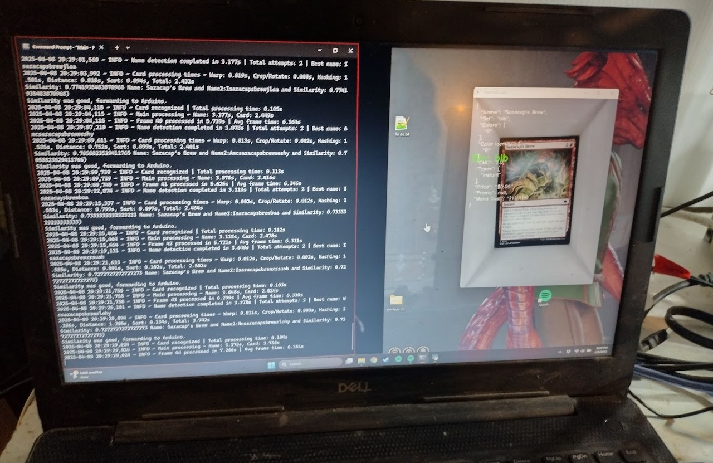
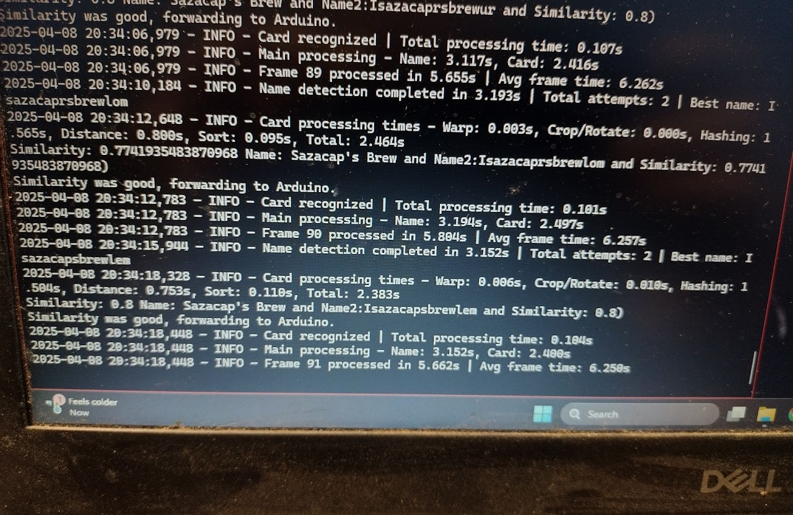

# Moss Machine - Open Source Magic: The Gathering - MTG - Sorting & Recognition

  

Welcome to the Moss Machine project! This open-source initiative provides a comprehensive system for automating the sorting, recognition, and management of Magic: The Gathering (MTG) cards, with potential expansion to other Trading Card Games (TCGs).

---

### Overview

The Moss Machine combines computer vision, machine learning, and hardware integration to create a reliable, customizable card sorting solution. Whether you're a collector, player, or developer, this project offers tools and guidance to build your own automated card sorting system.

---

## Features

- **Open Source & Community Driven**  
  Fully open source code with transparent development. Contributions and modifications are encouraged—please credit the original source when creating derivatives.

- **Versatile Recognition Methods**  
  - Uses OpenCV for precise card detection and perspective correction at any angle.  
  - Employs advanced contour detection for accurate boundaries even in imperfect lighting conditions.  
  - Implements image hashing techniques for quick identification against a database of known card images, including color channel separation (RGB) for improved accuracy.  
  - Integrates Tesseract OCR for secondary verification through text recognition (e.g., card names).

- **Sorting & Organization**  
  - Multiple sorting modes based on card attributes such as color, mana value (CMC), type, set, and market value brackets.  
  - Supports flexible system configurations, including set grouping and custom filters.  
  - Special "buy mode" for evaluating purchase decisions based on price thresholds, helping collectors maintain budgets.

- **Hardware Integration**  
  Designed to interface with physical sorting hardware via serial communication, configurable for different bin layouts and rejection mechanisms.

- **Performance & Logging**  
  - Detailed timing logs for each processing stage.  
  - Robust multiple attempt strategies for reliable name detection and image matching.  
  - Excludes digital-only and promotional sets for focused collection management.

- **Configurable & Extensible**  
  - Centralized configuration files for all settings.  
  - Adjustable thresholds for matching accuracy.  
  - Easy modification of sorting logic and set filters.

- **Technology Stack**  
  - Python: OpenCV, Tesseract OCR, ImageHash, PySerial, YOLO (Ultralytics), Pillow, NumPy, JSON, Scikit-Image  
  - C++: Arduino control and decision-making  

---

## Pictures

---

### Disclaimer

- The project is open source and may evolve significantly over time.  
- All code is thoroughly tested but may require calibration based on your hardware setup.  
- Use caution—never put valuable cards in the machine without testing.  
- If you modify or create your own variations, please credit the original source.

---

## Build Your Own

### Get Started
- All necessary files, including code, 3D print files, and hardware schematics, are available in this repository.
- Follow the detailed instructions within the Discord under #assembly

---

## Legal & Usage Notice

**Disclaimer:**  
This system is intended for hobbyist and educational use. Always test with non-valuable cards first. Handle valuable or rare cards with care—never trust automated sorting in critical scenarios. The project is open source; use at your own risk.

---

## Connect with Us & Follow

|  |  |  |
|:----------------------------------------:|:----------------------------------:|:----------------------------------:|
| **Join our Discord:** [https://discord.gg/2gNWpV6UjW](https://discord.gg/2gNWpV6UjW) | **Reddit:** [r/MossMachine](https://www.reddit.com/r/MossMachine/) | **Repository:** [GitHub](https://github.com/KairiCollections/Moss-Machine---Magic-the-Gathering-recognition-and-sorting-machine) |

---

## Support
Help keep my motivation and my wife less annoyed with the machine's existence
- Patreon - https://www.patreon.com/KairiCollections
- By me a coffee - https://www.buymeacoffee.com/KairiCollections
- Ko-fi - http://ko-fi.com/kairiskyewillow

Other non-related support:
- https://www.etsy.com/shop/KairiCollections

---

## Acknowledgments & License

This project is licensed under the **Creative Commons Attribution-NonCommercial-ShareAlike 4.0 International License (CC BY-NC-SA 4.0)**.  
Please give credit to the original authors when creating derivatives.

---

**Happy Sorting & Recognizing!**  
*Build smarter, organize better, and enjoy your collection to the fullest!*
